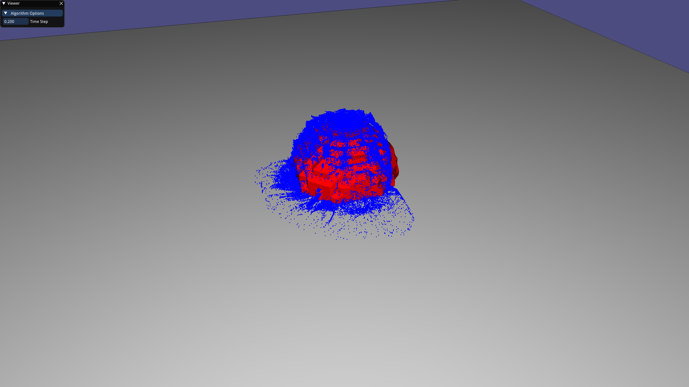

# Fluid Simulation

Fluid simulation implementation for the 2018-2019 Game Physics course. The goal was to realistically simulate fluids in 3D. We have based ourself on the principle of the MaC grid explained in the slides, but we have mainly based the simulation on a paper by David Cline, David Cardon and Parris K. Egbert: [Fluid Flow for the Rest of Us: Tutorial of the Marker and Cell Method inComputer Graphics](https://pdfs.semanticscholar.org/9d47/1060d6c48308abcc98dbed850a39dbfea683.pdf).

## Compilation

A [CMake](https://cmake.org) project is included in the repository for the sake of compilation. Our repository uses `git submodules` meaning that you will either have to clone the repository using 
```
git clone https://github.com/iwanbok/INFOMGP_Project.git
``` 
or after cloning run the following command in the root of repository 
```
git submodule update --init --recursive
```

After cloning the repository use the CMake GUI on Windows or use the commands
```
mkdir build
cd build
cmake .. <-G=generator>
```
then compile using your favored compiler.

## Usage

The simulation supports launching with scenes containing meshes, it has as of yet not been implemented that these meshes have actual collision with the fluid. Loading meshes is done automatically from the data folder, you can switch scenes by pressing the `,` and `.` keys, scenes can also be reset by pressing the `R` key. Starting a simulation is done by pressing the `spacebar` or the simulation can be run step-by-step by pressing the `S` repeatedly. Rotating around can be done by holding down the left mouse button, while moving around can be done holding down the right mouse button, the scroll wheel zooms in and out.

## Feature overview

+ 3D incompressible fluid simulation
+ MaC Grid style implemenation of the fluid simulation
+ Collision with pre set Solid objects
+ Scene switching for creating nice views

## Libraries in use

+ Libigl for rendering purposes
+ Eigen from libigl for vector/matrix math
+ PolyVox for creating meshes of the voxelgrid

## Screenshots
#### Representative screenshot
